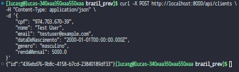
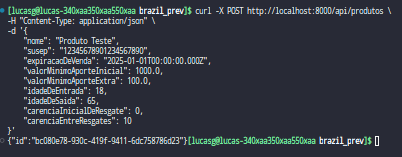
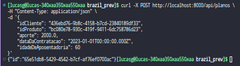
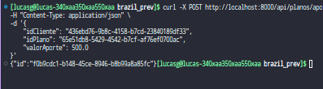
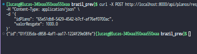

# Crud de um sistema de previdência


    Cadastro de cliente
    Cadastro de produto
    Contratação de plano
    Resgate de plano
    Aporte extra

A API implementa todas as regras de negócio necessárias, como validação do período de venda dos produtos, requisitos de valor mínimo de aporte e regras de carência para resgate.

## Contato

Para qualquer dúvida ou problema, entre em contato com:

    Email: lmgomes96@gmail.com
    Telefone: +55 99955-0862

## Informações Gerais

    A aplicação roda na porta http://localhost:8000.
    A documentação da API pode ser acessada em http://localhost:8000/docs.

## Configuração e Execução

### Pré-requisitos

    - Docker
    - Docker Compose

### Passos para Configuração e Execução

1. Construir a Imagem Docker

Para construir a imagem Docker do projeto, execute o seguinte comando:

```bash
make build
#ou
docker-compose build --no-cache
```

2. Executar o Projeto

Para iniciar os serviços definidos no docker-compose.yml, execute:

```bash
make run
#ou
docker-compose up -d
```

3. Aplicar Migrações

Para aplicar todas as migrações pendentes, execute:

```bash
make db-upgrade
#ou
docker-compose run --rm web poetry run alembic upgrade head
```

4. Parar os Serviços

Para parar todos os serviços, execute:

```
make down
#
docker-compose down
```

### Testes

Para rodar os testes é necessário que os containers estejam ativos.

1. Executar Testes

Para executar todos os testes, utilize:

```bash
make test
# ou
docker-compose run --rm web poetry run pytest tests/ --disable-warnings
```

Você pode especificar um módulo opcionalmente:

```bash
MODULE=unit/cliente make test
```

2. Executar Testes com relatório de cobertura

Para executar os testes e gerar um relatório de cobertura, utilize:

```bash
make test-coverage
# ou
docker-compose run --rm web poetry run pytest --cov=api --cov-report=term-missing --cov-report=html
```

O relatório será gerado em em htmlcov/index.html, abra o arquivo no seu navegador.

# Evidências de funcionamento das apis

Esta seção apresenta as evidências do funcionamento das apis desenvolvidas para o projeto.

## Cadastro de Produto



## Cadastro de Cliente



## Contrato de Plano



## Aporte Extra



## Resgate



# Evidências de Testes

Esta seção apresenta as evidências dos testes realizados no projeto. As evidências incluem a saída dos testes e capturas de tela, proporcionando uma visão clara da cobertura e dos resultados dos testes.

O relatório de cobertura é gerado em uma etapa do CI/CD e pode ser acessado em https://gomeslucasm.github.io/brasil_prev/index.html.

## Testes de Cobertura

Os testes foram executados utilizando o pytest com cobertura de código. Abaixo estão as saídas dos testes indicando a cobertura para cada módulo.

### Saída dos Testes

Os teste foram executados utilizando o comando `make test`, para garantir que todos os endpoints implementados estejam funcionando corretamente. A imagem abaixo mostra a saída dos testes:


## Saída dos relatório de cobertura

Os testes de cobertura foram executados utilizando o comando `make test-coverage`, que executa os testes e gera um relatório de cobertura de código. A imagem abaixo mostra a saída do teste de cobertura:


